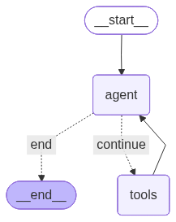

# Medical Q&A Agentic System with RAG

An intelligent medical information assistant powered by **Google Gemini 2.5 Flash**, **Qdrant vector database**, and **LangGraph**. The system uses RAG to answer medical queries from a 16K+ medical Q&A knowledge base with web search fallback.

## Features

- **Dual Vector Collections**: Medical Q&A and hospital information
- **Agentic Workflow**: LangGraph-powered autonomous tool selection
- **Smart Retrieval**: Semantic search with sentence transformers
- **Web Search Fallback**: SerpAPI for current information
- **GPU Acceleration**: CUDA support

## Architecture



The system uses LangGraph with conditional routing:

- **Agent**: Analyzes query and decides action
- **Tools**: Executes retrieval or web search
- **Routing**: Continues if ACTION found, ends if ANSWER ready

## Project Structure

```
.
├── Create_QdrantDB.py       # Vector database creation
├── System.py                # Agent orchestration
├── Tools.py                 # RAG retrieval & web search
├── Data/                    # CSV data files
│   ├── Comprehensive-Medical-Q&A.csv
│   └── Hospital_information.csv
├── .env                     # API keys
└── requirements.txt
```

## Requirements

- Python 3.10+
- CUDA (optional, for GPU)
- Internet connection

## Installation

### 1. Clone repository

```bash
git clone https://github.com/VyDat-1702/Agentic-AI-with-Tools.git
cd Agentic-AI-with-Tools/
```

### 2. Install dependencies

```bash
pip install -r requirements.txt
```

Key packages: `qdrant-client`, `sentence-transformers`, `google-generativeai`, `langgraph`, `pandas`, `python-dotenv`, `requests`

### 3. Configure API keys

Create `.env` file:

```env
GEMINI_API_KEY=your_gemini_api_key
QDRANT_URL=your_qdrant_url
QDRANT_API_KEY=your_qdrant_api_key

SERPAPI_KEY=your_serpapi_key
```

**Get API keys:**

- Gemini: [Google AI Studio](https://aistudio.google.com/apikey)
- Qdrant: [Qdrant Cloud](https://cloud.qdrant.io/)
- SerpAPI: [SerpAPI Dashboard](https://serpapi.com/manage-api-key)

### 4. Prepare data

Place CSV files in `Data/` folder:

- **Medical Q&A** (filename with "Q&A"): columns `qtype`, `Question`, `Answer`
- **Hospital info**: columns `Hospital Name`, `Specialty`, `Address`, `Province/City`

## Usage

### Step 1: Create Vector Database

```bash
python3 Create_vectorDB.py \
    --dir Data \
    --collection medical_qa_kb \
    --batch_size 128 \
    --upload_batch_size 128 \
    --max_workers 2 \
```

**Options:**

- `--dir`: Your data directory
- `--collection`: collection name
- `--batch_size`: embedding batch size
- `--upload_batch_size`: upload batch
- `--max_worker`: max num worker

Creates collections:

- `Comprehensive-Medical-QA` (for Q&A data)

### Step 2: Run Agent

```bash
python3 System.py
```

**Interactive mode:**

```
User: What are symptoms of diabetes?
Bot: [Answer with medical disclaimer]

Type 'quit', 'exit', or 'esc' to stop.
```

## Components

### Create_QdrantDB.py

- Ingests CSV data into Qdrant vector database
- Uses `all-MiniLM-L6-v2` for embeddings (384 dimensions)
- Batch processing: 128 for encoding, 128 for upload
- Auto-detects data type (Q&A vs Hospital) from filename

### Tools.py

- **QA_Retriever**: Searches medical FAQ knowledge base
- **WebSearcher**: Searches web via SerpAPI
- Returns context, source, and results for agent

### System.py

- **Gemini wrapper**: Calls Gemini 2.5 Flash (temp=0, max_tokens=1024)
- **LangGraph workflow**: Agent → Tools → Decision loop
- **State management**: Tracks query, observations, and steps (max 10)
- **Routing logic**: Continues on ACTION, ends on ANSWER

## Configuration

**Environment Variables:**

```env
GEMINI_API_KEY          # Google Gemini API
QDRANT_URL              # Qdrant instance URL
QDRANT_API_KEY          # Qdrant authentication
SERPAPI_KEY             # Optional, for web search
```

**Key Settings:**

- Embedding: `all-MiniLM-L6-v2` (384D)
- LLM: Gemini 2.5 Flash (temp=0)
- Top-K results: 3
- Max agent steps: 10
- Device: Auto-detect CUDA/CPU

## Safety Features

- Medical disclaimers in all responses
- Does NOT diagnose or prescribe
- Emergency handling (advises calling 115)
- Max 10 steps to prevent loops

## Troubleshooting

| Issue                    | Solution                                               |
| ------------------------ | ------------------------------------------------------ |
| Qdrant connection failed | Check `.env` for correct URL (must include `https://`) |
| Collection not found     | Run `python Create_QdrantDB.py` first                  |
| GEMINI_API_KEY not found | Add key to `.env` file                                 |
| Slow performance         | Use GPU: system auto-detects CUDA                      |
| Web search not working   | Add `SERPAPI_KEY` (optional, works without it)         |
| No CSV files found       | Place CSV files in `Data/` directory                   |

## Performance

**Database Creation:**

- CPU: ~3-5 min (16K docs)
- GPU: ~1-2 min (16K docs)

**Query Response:**

- FAQ search: 100-300ms
- With web search: 1-3s

## Limitations

- Not FDA approved or medically certified
- FAQ database requires manual updates
- SerpAPI rate limits (100/month free)
- Responses are informational only

## Future Improvements

- [ ] Conversation memory
- [ ] Multi-language support
- [ ] Web UI (Streamlit/Gradio)
- [ ] Medical image analysis
- [ ] Fine-tuned medical embeddings

---
